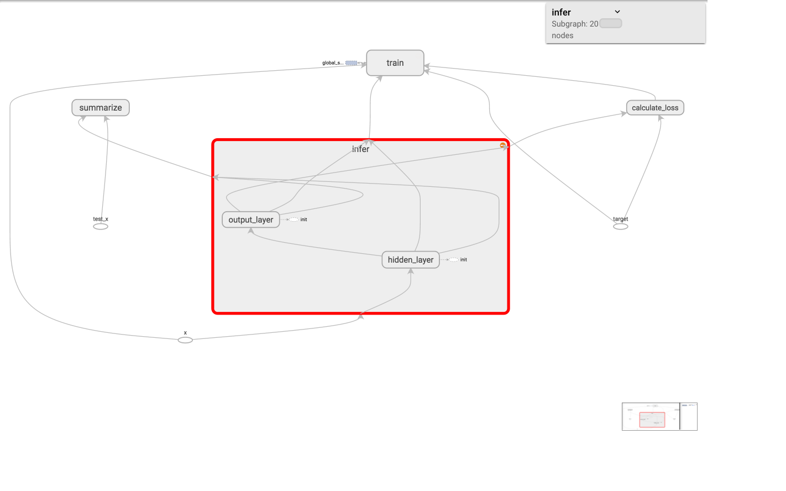
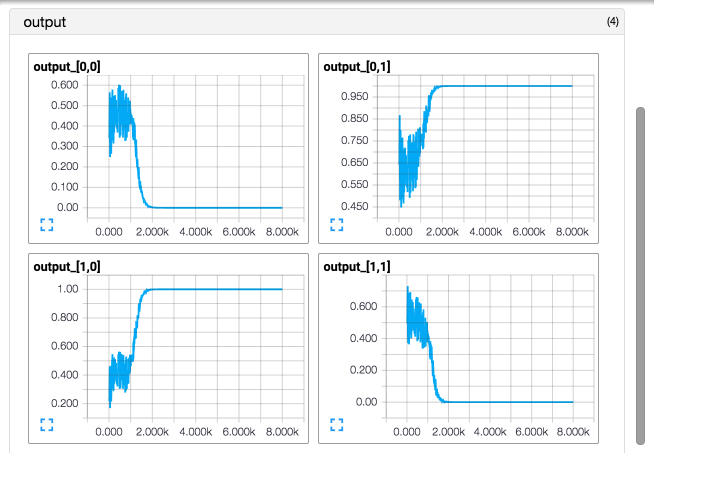
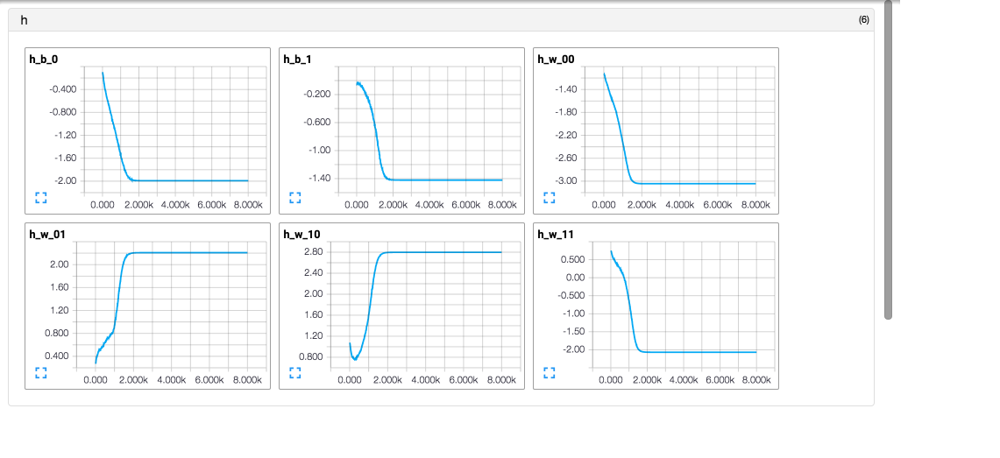
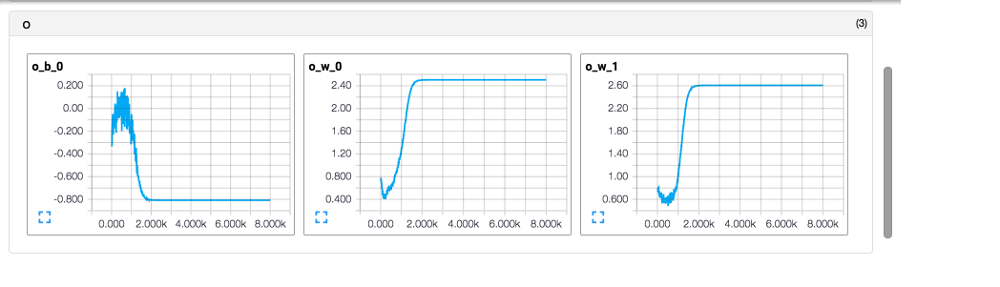

This is a neural network with one hidden layer to simulate the logical XOR.

Console output will be something like

```
final output of the test input:
[ 0.  0.] => [  1.19209290e-07]
[ 0.  1.] => [ 0.99999976]
[ 1.  0.] => [ 0.99999964]
[ 1.  1.] => [  3.57627869e-07]
final loss after training: 1.6342482922482304e-13
```

You can see XOR(0, 0) and XOR(1, 1) are nearly 0, and XOR(0, 1) and XOR(1, 0) are nearly 1.

#### graph



#### loss over steps


#### outputs of the test inputs over steps



#### mean difference of test outputs to the target over steps


#### hidden layer parameters over steps



#### output layer parameters over steps


