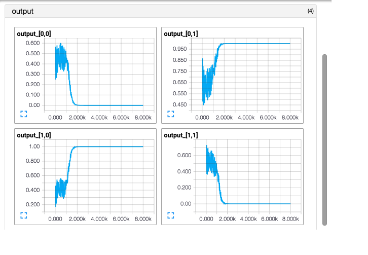

This is a neural network with one hidden layer to simulate the logical XOR.

Console output will be something like

```
final output of the test input:
[[  7.74860382e-07]
 [  1.00000024e+00]
 [  9.99999464e-01]
 [ -2.38418579e-07]]
final loss after training: 5.00932628711e-13
```

#### graph


#### loss over steps


#### outputs of the test inputs over steps



#### mean difference of test outputs to the target over steps


#### hidden layer parameters over steps


#### output layer parameters over steps


