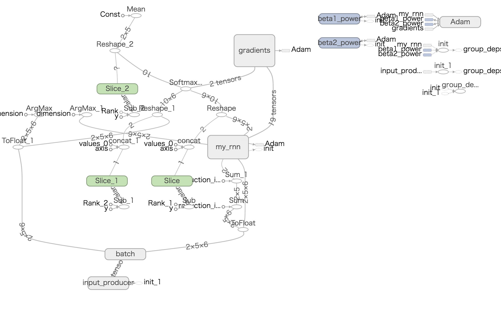

### minimum language model with the basic RNN

This is an RNN with 1 hidden layer of the most basic RNN cells that predicts a sequence given the first element of the sequence.

Training data is hard coded as follows for demonstration.

||sequence 0|sequence 1|
|---|---|---|
|**input**|`['it', 'was', 'hot', '.']`|`['was', 'it', '?']`|
|**label**|`['was', 'hot', '.', '<eos>']`|`['it', '?', '<eos>']`|

After training, it can predict sequences.

| | test 0 | test 1 |
| --- | --- | --- |
| **input** | `['it']` | `['was']` |
| **inference** | `['was', 'hot', '.', '<eos>']` | `['it', '?', '<eos>']` |

Note that `it` is followed by `was hot.` or `?`, and `was` is followed by `hot.` or `it?` depending on the context. The model has correctly learned it.

This is the TensorFlow graph generated by TensorBoard.



---

To start a TensorBoard, run

```docker run -it --rm -p 6006:6006 -v `pwd`/logdir:/mnt tensorflow/tensorflow:latest-py3 bash```

on your terminal, run

`tensorboard --logdir=/mnt`

in the container, and open [http://localhost:6006/](http://localhost:6006/) with your browser.

---

This is an example output of `main.py`.

```
perplexity: 3.165, batch_accuracy: 0.0
step 1
perplexity: 3.099, batch_accuracy: 0.0
step 2
perplexity: 3.039, batch_accuracy: 0.0
step 3
perplexity: 2.983, batch_accuracy: 0.0
step 4
perplexity: 2.932, batch_accuracy: 0.0
step 5
perplexity: 2.885, batch_accuracy: 0.0
step 6
perplexity: 2.841, batch_accuracy: 0.0
step 7
perplexity: 2.800, batch_accuracy: 0.0
step 8
perplexity: 2.762, batch_accuracy: 0.0
step 9
perplexity: 2.726, batch_accuracy: 0.0
step 10
perplexity: 2.694, batch_accuracy: 0.0
step 11
perplexity: 2.663, batch_accuracy: 0.0
step 12
perplexity: 2.635, batch_accuracy: 0.0
step 13
perplexity: 2.609, batch_accuracy: 0.0
step 14
perplexity: 2.585, batch_accuracy: 0.0
step 15
perplexity: 2.563, batch_accuracy: 0.0
step 16
perplexity: 2.542, batch_accuracy: 0.0
step 17
perplexity: 2.523, batch_accuracy: 0.0
step 18
perplexity: 2.505, batch_accuracy: 0.0
step 19
perplexity: 2.488, batch_accuracy: 0.0
step 20
perplexity: 2.472, batch_accuracy: 0.0
step 21
perplexity: 2.458, batch_accuracy: 0.0
step 22
perplexity: 2.444, batch_accuracy: 0.0
step 23
perplexity: 2.430, batch_accuracy: 0.0
step 24
perplexity: 2.418, batch_accuracy: 0.0
step 25
perplexity: 2.406, batch_accuracy: 0.0
step 26
perplexity: 2.394, batch_accuracy: 0.0
step 27
perplexity: 2.382, batch_accuracy: 0.0
step 28
perplexity: 2.370, batch_accuracy: 0.0
step 29
perplexity: 2.359, batch_accuracy: 0.0
step 30
perplexity: 2.347, batch_accuracy: 0.0
step 31
perplexity: 2.335, batch_accuracy: 0.0
step 32
perplexity: 2.323, batch_accuracy: 0.0
step 33
perplexity: 2.310, batch_accuracy: 0.0
step 34
perplexity: 2.297, batch_accuracy: 0.0
step 35
perplexity: 2.284, batch_accuracy: 0.0
step 36
perplexity: 2.270, batch_accuracy: 0.5
step 37
perplexity: 2.256, batch_accuracy: 0.5
step 38
perplexity: 2.242, batch_accuracy: 0.5
step 39
perplexity: 2.228, batch_accuracy: 0.5
step 40
perplexity: 2.213, batch_accuracy: 0.5
step 41
perplexity: 2.198, batch_accuracy: 1.0
inference accuracy: 1.0
```
