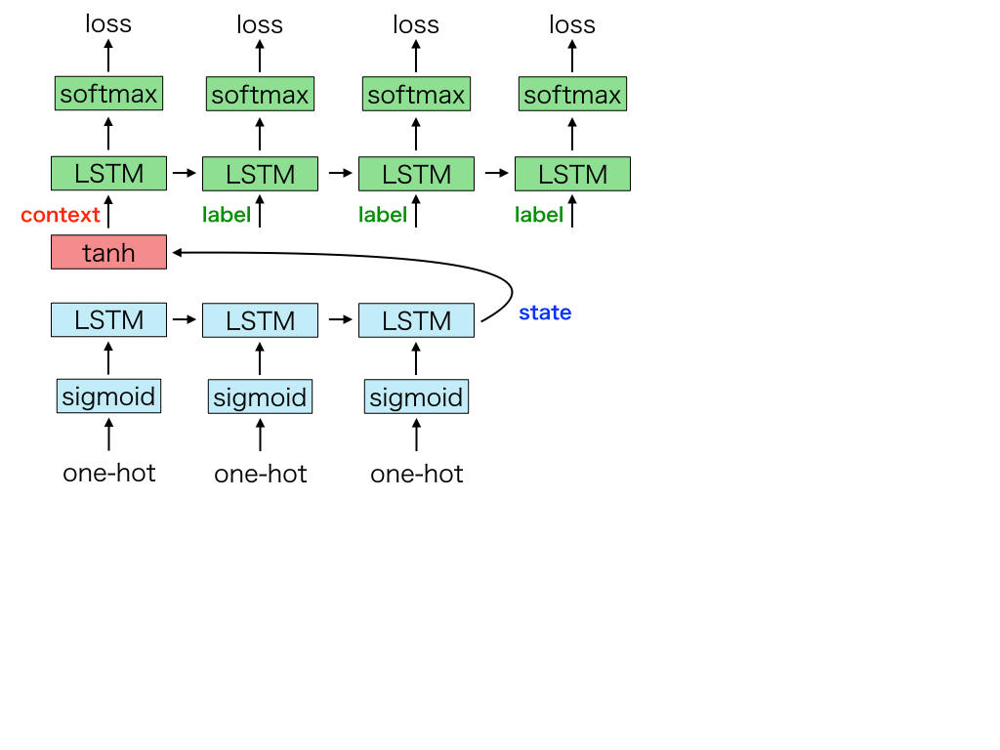
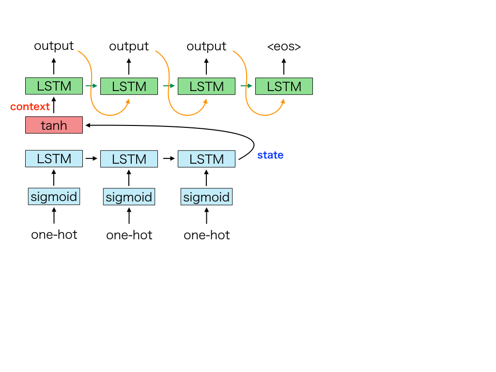
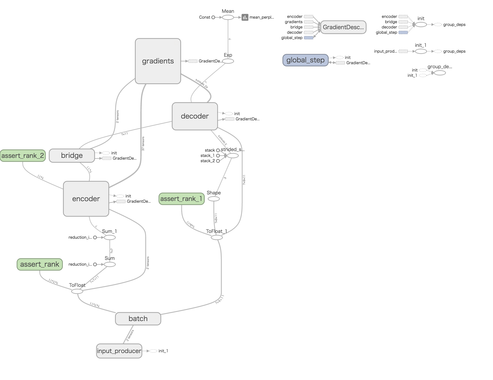
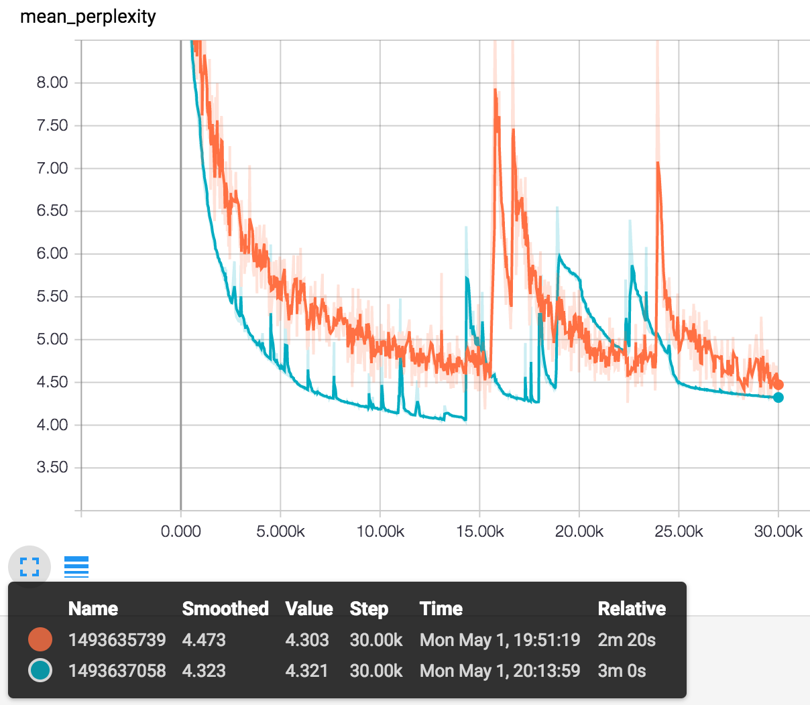

## barebones model of machine translation

### training

### inference

### TensorBoard graph

### perplexity

orange - training data size: 20, batch size: 10, epochs: 15000

green - training data size: 20, batch size: 20, epochs: 30000

#### notes

- The perplexity suddenly went up after getting low maybe because there was not learning rate decay.
- On each step, the orange line fluctuated more wildly because the batch size was smaller than the green line.
