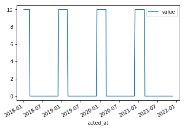

### What
This is a neural network written in TensorFlow 1.8.0 to predict timestamped values.

The input is a batch of timestamp strings and the output is the same number of float values.

### How
(1)
Modify `generate_data.py` and run

```bash
docker run --rm \
    -v `pwd`:/opt/project -w=/opt/project \
    tensorflow/tensorflow:latest-py3 \
    python generate_data.py
```
to generate CSV files of dummy data.

Make sure files are generated in `./`

(2) Run
```bash
docker run --rm \
    -v `pwd`:/opt/project -w=/opt/project \
    tensorflow/tensorflow:latest-py3 \
    python main.py
```

An example output:
```text
{'average_loss': 0.07394719, 'loss': 3.6973598, 'global_step': 2000}
(2018, 1, 6, 31, 5, 10) 10.697932243347168
(2018, 1, 7, 31, 6, 10) 10.306427001953125
(2018, 1, 7, 31, 6, 10) 10.306427001953125
```

Interesting values to modify in the source code:
- `BATCH_SIZE`, `REPEAT`, `TRAINING_STEPS`
- `train`, `validate`, `predict`
- `hidden_units`

While or after training, run
```bash
docker run -it --rm -p 6006:6006 \
    -v `pwd`/model_dir:/mnt \
    tensorflow/tensorflow:latest-py3 \
    tensorboard --logdir /mnt
```
and access `http://localhost:6006/` to see TensorBoard.

To visually see the data,

(1) Run
```bash
docker run -it --rm -p 8888:8888 \
    -v `pwd`:/notebooks \
    tensorflow/tensorflow:latest-py3
```

(2) Access the URL presented in the terminal.

(3) Open `plot.ipynb`.

An example image:


